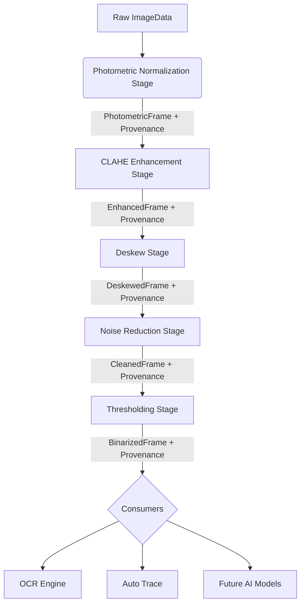

# OCR-ARCH-01 — Scientific Image Processing Pipeline

## 1. Architecture Specification

The Scientific Image Processing Pipeline is designed to apply a sequence of independent, immutable transformations to raw raster images. Each transformation acts as a discrete module (stage) in the pipeline, taking an immutable input and producing an immutable output, alongside complete metadata (provenance) of the operation.

### Core Principles
- **Immutability:** Original data and intermediate representations are never modified in place. Each stage returns a new data structure.
- **Independence:** Stages are decoupled. A stage relies only on its defined input contract, completely unaware of the broader pipeline structure or execution order.
- **Traceability (Provenance):** Every single transformation records its configuration, version, decision parameters, and execution timestamp to ensure fully auditable and reproducible results.
- **Selectivity:** Downstream consumers (OCR Orchestrator, Auto Trace, Future AI) can subscribe to specific stages or assemble custom sub-pipelines without altering the core processing modules.

## 2. Interface Contract

All processing stages must adhere to a standardized contract defined by a generic `PipelineStage` interface.

```typescript
/**
 * Generic contract for all scientific image processing stages.
 */
export interface PipelineStage<InputType, OutputType> {
  /** 
   * Unique identifier of the stage (e.g., 'photometric_normalization', 'clahe_enhancement').
   */
  readonly id: string;

  /**
   * Version of the specific algorithm implemented in this stage.
   */
  readonly version: string;

  /**
   * Executes the processing stage on the given input.
   * Must return a newly instantiated OutputType (immutable operation).
   */
  execute(input: InputType, parameters?: Record<string, unknown>): OutputType;
}

/**
 * Standard envelope for data traversing the pipeline.
 */
export interface PipelineEnvelope<T> {
  readonly data: T;
  readonly provenance: ProvenanceRecord[];
}
```

## 3. Data Flow Diagram



## 4. Processing Stage Definition

The pipeline will initially comprise the following standard stages:

1. **Photometric Normalization (`PhotometricStage`)**
   - **Input:** `ImageData` (Raw RGBA raster)
   - **Output:** `PhotometricFrame` (Grayscale representation, Min/Max/Mean stats, auto-inverted if needed)
   - **Responsibility:** Standardizes colorspace, computes luminance, detects polarity, and handles conditional auto-invert.

2. **Contrast Enhancement (`CLAHEStage`)**
   - **Input:** `PhotometricFrame`
   - **Output:** `EnhancedFrame` (CLAHE-applied grayscale)
   - **Responsibility:** Applies Contrast Limited Adaptive Histogram Equalization to locally enhance features, particularly in unevenly illuminated logs.

3. **Geometric Correction (`DeskewStage`)**
   - **Input:** `EnhancedFrame` (or `PhotometricFrame`)
   - **Output:** `DeskewedFrame` (Rotated raster, Affine matrix)
   - **Responsibility:** Detects rotational skew and corrects the image geometry. Records the rotation angle in provenance.

4. **Noise Reduction (`DenoiseStage`)**
   - **Input:** `DeskewedFrame`
   - **Output:** `CleanedFrame`
   - **Responsibility:** Applies spatial filters (e.g., Median, Gaussian, or Anisotropic diffusion) to suppress high-frequency artifact noise.

5. **Binarization (`ThresholdStage`)**
   - **Input:** `CleanedFrame`
   - **Output:** `BinarizedFrame` (1-bit mask or 8-bit equivalent)
   - **Responsibility:** Adaptive or global thresholding (e.g., Sauvola, Otsu) to separate foreground (text/curves) from the background.

## 5. Provenance Model

Provenance is an immutable, append-only ledger attached to the pipeline envelope. It guarantees traceability of the data transformations.

```typescript
/**
 * Represents a single transformation event in the pipeline.
 */
export interface ProvenanceRecord {
  /** Identifier of the stage that performed the transformation */
  readonly stageId: string;
  
  /** Algorithm version */
  readonly algorithmVersion: string;
  
  /** UTC timestamp of the execution */
  readonly timestamp: number;
  
  /** Execution duration in milliseconds */
  readonly executionTimeMs: number;
  
  /** The parameters passed to or computed by the stage (e.g., autoInvertThreshold, claheClipLimit, deskewAngle) */
  readonly parameters: Record<string, unknown>;
  
  /** Stage-specific metrics or decisions (e.g., polarity detected, confidence) */
  readonly metrics: Record<string, unknown>;
}
```

## 6. Dependency Rules

To prevent architectural degradation, the following dependency rules are enforced:

1. **Strict Immutability:** A stage must never mutate its `InputType`. Modifications require allocating and returning a new representation.
2. **Acyclic Flow:** Stages operate in a strictly unidirectional flow. Circular dependencies between stages are prohibited.
3. **Parameter Injection:** Stages must not rely on global state. All necessary configurations must be passed via the `parameters` argument during `execute()`.
4. **Graceful Fallback:** If a stage fails (e.g., Deskew cannot determine an angle), it should gracefully return the input representation wrapped in the output type, appending a provenance record indicating a bypassed or failed operation.
5. **Decoupled Consumers:** Consumers (like OCR or Auto Trace) must depend on the output interfaces (e.g., `BinarizedFrame`), not on the implementation of the stages themselves. This allows hot-swapping implementations (e.g., replacing standard Binarization with AI-based Binarization) without breaking consumers.
