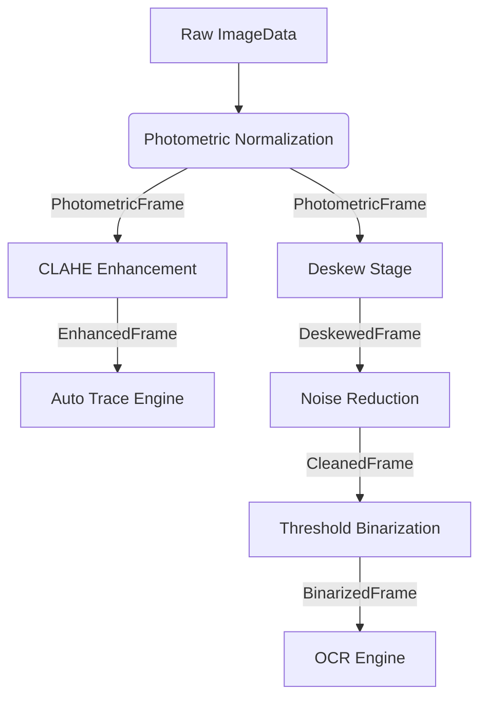

# OCR-ARCH-02 — Pipeline Contract Refinement

## 1. Refined Interface Contract

The `PipelineStage` contract has been updated to use strict static typing for inputs, outputs, and parameters. To provide a consistent envelope for execution metadata, the `execute()` method now returns a `StageResult<Output>`, wrapping the output data alongside operational status and provenance.

```typescript
/**
 * Defines the possible execution statuses of a pipeline stage.
 */
export enum StageExecutionStatus {
  SUCCESS = 'SUCCESS', // Transformation successfully applied
  FAILED = 'FAILED',   // Unrecoverable error during execution
  SKIPPED = 'SKIPPED'  // Condition not met (e.g., auto-invert threshold not reached, no rotation needed)
}

/**
 * The standard envelope returned by every stage execution.
 * Wraps the immutable output data, execution status, and diagnostic metadata.
 */
export interface StageResult<OutputType> {
  readonly data: OutputType;
  readonly status: StageExecutionStatus;
  readonly provenance: StageProvenance;
  readonly diagnosticMessage?: string; // Optional context, especially for FAILED or SKIPPED states
}

/**
 * Generic, statically typed contract for all scientific image processing stages.
 */
export interface PipelineStage<InputType, OutputType, ParametersType = Record<string, unknown>> {
  /** 
   * Unique identifier of the stage (e.g., 'photometric_normalization').
   */
  readonly id: string;

  /**
   * Semantic version of the specific algorithm implemented in this stage.
   */
  readonly version: string;

  /**
   * Executes the processing stage on the given immutable input using the provided parameters.
   * Returns a StageResult containing the new immutable output and execution metadata.
   */
  execute(input: InputType, parameters: ParametersType): StageResult<OutputType>;
}
```

## 2. Separation of Provenance

To maintain scientific integrity while accommodating operational metrics, provenance is now explicitly divided into **Scientific Provenance** and **Operational Provenance**.

### Design Rationale
- **Scientific Provenance** ensures the reproducibility and verifiability of the actual algorithm. It records variables that directly influence the mathematical output (e.g., threshold values, algorithmic decisions like `wasInverted`, filter sizes). If scientific provenance is identical across two runs, the resulting bits must be mathematically identical.
- **Operational Provenance** records infrastructural execution metrics that have no bearing on the scientific output. This includes execution time, server identity, memory usage, and execution timestamps. Separating this allows caching layers to correctly identify when two different operational runs actually produced identical scientific results.

```typescript
export interface StageProvenance {
  readonly scientific: ScientificProvenance;
  readonly operational: OperationalProvenance;
}

/**
 * Factors that directly determine or describe the transformation outcome.
 */
export interface ScientificProvenance {
  readonly algorithmVersion: string;
  readonly parametersApplied: Record<string, unknown>; // E.g., { autoInvertThreshold: 0.5 }
  readonly deterministicDecisions: Record<string, unknown>; // E.g., { polarity: 'INVERTED', confidence: 0.95 }
}

/**
 * Infrastructural metrics unrelated to the mathematical outcome of the transformation.
 */
export interface OperationalProvenance {
  readonly timestampMs: number;
  readonly executionDurationMs: number;
  readonly executionContext?: string; // e.g., thread ID, node environment
}
```

## 3. Directed Acyclic Graph (DAG) Execution Model

The pipeline is **no longer defined as a mandatory linear sequence**. Instead, it operates as a **Directed Acyclic Graph (DAG)** of dependencies. 

### Rationale
Not all downstream tasks require the same preprocessing steps. An OCR engine might require full binarization, while a visual curve-tracing algorithm (Auto Trace) might only require CLAHE enhancement on grayscale images. 

By modeling the pipeline as a DAG:
- **Stages are independent nodes.** They specify what input type they require but do not dictate who provides it.
- **Consumers build dynamic sub-pipelines.** A consumer simply requests a specific target representation (e.g., `BinarizedFrame`), and the orchestrator resolves the dependency graph backward to invoke only the necessary preceding stages.
- **Data flow branches naturally.** `PhotometricFrame` can be routed simultaneously to the `CLAHEStage` for tracing and the `BinarizationStage` for text extraction, without linear bottlenecks.


